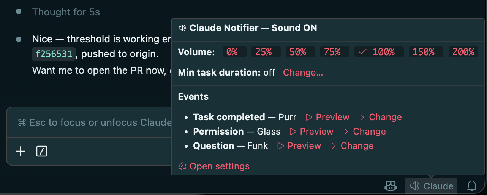

# Claude Notifier

**supports Codex too**

[](https://marketplace.visualstudio.com/items?itemName=SingularityInc.claude-notifier)
[](https://ko-fi.com/ashmitb95)

Plays a sound and shows a notification when [Claude Code](https://claude.com/claude-code) or [Codex](https://developers.openai.com/codex) finishes a task, needs permission, or asks a question.

Stop watching the screen — go grab a coffee and let your agent ping you when it needs you.

Works with **VSCode**, **terminal CLI**, **vim**, or any editor where you use Claude Code or Codex — on **macOS**, **Windows**, **WSL**, and **Linux**, including **remote hosts over SSH**.

## What's new — 4.0.0

- **Codex support.** [Codex](https://developers.openai.com/codex) sessions now drive the same notifications as Claude Code — same sounds, same per-event levels, same mute and auto-mute behaviour. The extension registers hooks in `~/.codex/hooks.json` when it finds Codex installed, and does nothing at all when it doesn't. ([#83](https://github.com/ashmitb95/claude-notifier/issues/83))

  **One setup step:** Codex won't run newly registered hooks until you trust them, so a fresh install is silent until you do. Run `codex` in a terminal once and pick **Trust all and continue** — full steps under [Codex](#codex).

## What's new — 3.7.1


- **Project-labelled notifications.** Each notification is now titled with the workspace name, so with several projects open you can tell at a glance which one just finished.
- **Auto-mute when focused.** Opt-in setting that mutes the completion sound and popups while the VS Code window running the task is focused — you can already see it working, so the ping is redundant. Scoped per-window, so a task finishing in a background window still notifies. Toggle it right from the panel above (details under [Auto-mute when focused](#auto-mute-when-focused)).
- **No notifications inside Cursor.** Cursor runs the same `~/.claude` hooks from its own Composer agent; the notifier now detects Cursor and stays silent there instead of firing for work that isn't a Claude Code session.
- **No stray notifications from a folderless window.** A VS Code window with no folder open no longer fires a duplicate notification for every project.
- **Remote audio.** When Claude runs on a remote host (SSH, WSL, dev container), notification sounds now play on your **local** machine instead of the headless remote — see [Remote hosts](#remote-hosts-ssh-wsl-dev-containers).
- **Per-session disable.** Set `CLAUDE_NOTIFIER_DISABLE` to silence the notifier for a single shell/session — handy on shared SSH hosts (see [below](#disable-per-session-claude_notifier_disable)).
- **Status-bar control panel.** Hover the **Claude** entry in the status bar for volume, per-event sound preview/swap, and the minimum-task-duration threshold.



## Install

### Option 1: VSCode Extension

Install from the [VS Marketplace](https://marketplace.visualstudio.com/items?itemName=SingularityInc.claude-notifier):

```sh
code --install-extension SingularityInc.claude-notifier
```

Or search for **"Claude Notifier"** in the Extensions tab (`Cmd+Shift+X` / `Ctrl+Shift+X`).

The extension auto-configures everything on activation. Reload VSCode after installing.


### Option 2: CLI (curl)

**macOS / Linux / WSL:**

```sh
curl -fsSL https://raw.githubusercontent.com/ashmitb95/claude-notifier/main/install.sh | bash
```

To uninstall:

```sh
curl -fsSL https://raw.githubusercontent.com/ashmitb95/claude-notifier/main/uninstall.sh | bash
```

**Windows:** install the VSCode extension. It auto-configures the PowerShell hooks; no separate CLI installer is needed.

## Codex

Codex sessions run through the same pipeline as Claude Code — same sounds, same per-event levels, same mute, auto-mute, and threshold settings. The extension registers its hooks in `~/.codex/hooks.json` when it finds Codex installed; if you don't have Codex, no `~/.codex` directory is created. Opt out any time with `claudeNotifier.codex.enabled`.

### Turning on notifications for Codex

**Codex will not run a newly registered hook until you trust it**, so there is one manual step after installing the extension. That gate is deliberate on Codex's part, and the extension doesn't grant the trust for you.

1. Install or reload the extension. It writes four hook registrations to `~/.codex/hooks.json` — `Stop`, `PermissionRequest`, `UserPromptSubmit`, and `SubagentStop`.
2. Run `codex` in a terminal. At startup it shows **Hooks need review** — _"4 hooks are new or changed."_
3. Choose **Review hooks** to read each entry first, or go straight to **Trust all and continue**.
4. Carry on. Notifications fire from that point on.

> **`zsh: command not found: codex`?** If you got Codex as the ChatGPT VS Code extension, the CLI is bundled inside it and isn't on your `PATH`. Add it for the current shell, then run `codex`:
>
> ```sh
> export PATH="$(dirname "$(ls -d ~/.vscode/extensions/openai.chatgpt-*/bin/*/codex | head -1)")":$PATH
> ```
>
> Installing the standalone CLI (`npm i -g @openai/codex`) works too. You only need it for this one-time approval — after that, Codex inside VS Code picks up the trust and you never need the terminal again.

You only do this once, and only in the terminal — trust is recorded in `~/.codex/config.toml` and applies to every project and to the Codex VS Code extension too. Codex pins it to a hash of the *registration entry* rather than the hook script's contents, so extension upgrades that rewrite the scripts don't re-trigger the prompt. Revisit the list any time with `/hooks`, or under `Tools & setup` → `Hooks`.

Picking **Continue without trusting** leaves the hooks registered but inert: Codex stays silent until you trust them.

The one gap is the "asks a question" sound — Codex has no `AskUserQuestion` equivalent, so that event only fires for Claude Code.

### Troubleshooting: no Codex notifications

Untrusted hooks are the usual cause, and they're easy to miss: Codex registers them, reports no error, and simply never runs them. Ask Codex's app server what it makes of the registration:

```bash
{ printf '%s\n' '{"jsonrpc":"2.0","id":1,"method":"initialize","params":{"clientInfo":{"name":"probe","version":"1"}}}'
  sleep 1
  printf '%s\n' '{"jsonrpc":"2.0","method":"initialized","params":{}}'
  printf '%s\n' '{"jsonrpc":"2.0","id":2,"method":"hooks/list","params":{"cwds":["/path/to/your/project"]}}'
  sleep 3; } | codex app-server
```

Each entry reports a `trustStatus`:

| Status | Meaning |
| --- | --- |
| `trusted` | Good — the hook runs. |
| `untrusted` | Registered but never invoked. Run `codex` and trust the hooks, as above. |
| `modified` | The registration changed since you approved it. Re-approve under `/hooks`. |

Or read `~/.codex/config.toml` directly — a trusted hook has a `trusted_hash` entry:

```toml
[hooks.state."/Users/you/.codex/hooks.json:stop:0:0"]
trusted_hash = "sha256:…"
```

If that all looks right and Codex is still silent:

- **No `~/.codex/hooks.json` at all.** The extension only writes it when `~/.codex` already exists, so it skips users who don't have Codex. Run Codex once, then reload VS Code. Check that `claudeNotifier.codex.enabled` is on, and look for the registration line in `View → Output → Claude Notifier`.
- **Sounds work in Codex but not from a plain terminal session,** or vice versa. That's the notifier's own routing, not Codex — the extension handles playback for any directory an open VS Code window owns, and the hook plays the sound itself otherwise.

Full detail in **[docs/CODEX.md](docs/CODEX.md)**.

## Remote hosts (SSH, WSL, dev containers)

When Claude runs on a **remote host**, notification sounds can play on your **local** machine instead of the (usually headless) remote — with your normal sound presets and volume, no terminal bell. A small `cn-daemon` helper runs locally, and the remote pushes events to it over an SSH reverse forward.

This is **opt-in**; existing local setups are unaffected. See **[docs/REMOTE_HOSTS.md](docs/REMOTE_HOSTS.md)** for the one-time setup (install the daemon, add a `RemoteForward` line, enable `claudeNotifier.remoteAudio`), or run **`Claude Notifier: Set up remote audio…`** from the Command Palette to walk through it.

## Configurable Settings

Open **Settings** → search **"Claude Notifier"** (`Cmd+,` / `Ctrl+,`) to set each event's notification level (`sound+popup` | `sound` | `popup` | `off`) and sound preset.

**Sound presets** — macOS: Basso, Blow, Bottle, Frog, Funk, Glass, Hero, Morse, Ping, Pop, Purr, Sosumi, Submarine, Tink. Windows: Windows Notify, tada, chimes, chord, ding, notify, ringin, Windows Background. On Linux the macOS names map to freedesktop XDG sounds under `/usr/share/sounds/freedesktop/stereo/`.

### Minimum task duration threshold

`claudeNotifier.minTaskDurationThreshold` (seconds, default `0`)

When `> 0`, notification sounds and popups are suppressed for any task that completes in less than this many seconds. Counted from the moment you submit the prompt. Set to `0` to disable (the default).

Useful when you're actively watching the IDE and don't need audio for sub-second roundtrips — set it to e.g. `10` and you'll only hear audio for longer-running work. Per-session marker files keep parallel Claude sessions (multiple terminals or VS Code windows) independent — each session times its own threshold.

### Auto-mute when focused

`claudeNotifier.autoMuteWhenFocused` *(boolean, default `false`)*

When on, the task-completed sound and all popups are suppressed while the VS Code window running the task is focused — if you're already looking at it, the notification is redundant. It's scoped per-window: a task finishing in a **background** window still notifies, so multi-window setups aren't silenced. Permission and question sounds still play. Toggle it quickly from the status-bar panel (hover the **Claude** item) or the **Claude Notifier: Toggle Auto-mute When Focused** command.

### Subagent handling

Claude Code emits an `agent_id` field on every hook payload that fires from inside a `Task` subagent. Two settings use this:

`claudeNotifier.suppressSubagentInteractions` *(boolean, default `true`)*

When true, permission and question hooks that originate from a subagent are silenced — no sound, no OS banner. The main agent's own permission and question prompts still notify normally. This affects **only the notifier's sound and popup**; the actual approve/deny dialog and question UI in Claude Code's chat are untouched.

`claudeNotifier.subagentCompleted.level` *(default `off`)*

A dedicated `SubagentStop` hook fires when a `Task` subagent finishes. The level defaults to `off`, so subagent completions are silent unless you opt in. Configurable like the other events:

- `claudeNotifier.subagentCompleted.level`: `sound+popup` | `sound` | `popup` | `off`
- `claudeNotifier.subagentCompleted.sound`: a sound preset (default `Pop`)

## How it works

- **Per-session dedup.** Rapid back-to-back events within a single Claude session coalesce automatically — one notification per stage, not a flood. A stage advances when you send your next prompt or after ~30 minutes of idle time.
- **Project-labelled notifications.** The notification title is the workspace name (or the project directory's name when the hook fires outside VS Code), so with several projects open you can tell which one just finished without opening anything.
- **Bundled fallback sounds.** If the configured system sound file is missing on disk, a bundled WAV plays so you still hear something.
- **Defers to other notification hosts.** Inside VS Code, the extension takes over from the hook fallback for the owning window. Inside [cmux](https://github.com/manaflow-ai/cmux), the hook detects cmux's `CMUX_CLAUDE_HOOK_CMUX_BIN` env var and skips its own sound + popup so cmux's native banner doesn't get double-stacked. Inside [Cursor](https://cursor.com) — which runs `~/.claude/settings.json` hooks from its own Composer agent — the hook detects Cursor's `CURSOR_*` environment and stays silent, so you don't get a notification for work that isn't a Claude Code session.
- **Diagnostic log.** `View → Output → Claude Notifier` shows activation, signal receipts, dedup decisions, and configuration warnings — useful when debugging "I didn't get a notification."

### Clickable macOS notifications (optional)

By default, macOS attributes `osascript` notifications to the Script Editor bundle, so clicking one opens Script Editor instead of focusing VS Code. To get clickable notifications that focus the specific window the notification fired from, install [`terminal-notifier`](https://github.com/julienXX/terminal-notifier):

```sh
brew install terminal-notifier
```

Or use the bundled command — open the Command Palette and run **"Claude Notifier: Install terminal-notifier (clickable macOS notifications)"**. It runs the `brew install` in an interactive VS Code terminal so you can see what's happening. Reload the window after install to enable it.

When `terminal-notifier` is present, the extension uses it automatically. When it's not, the extension falls back to the standard `osascript` notification (everything still works — clicks just open Script Editor).

## Mute/unmute (CLI)

**macOS / Linux / WSL:**

```sh
touch ~/.claude/hooks/claude-notifier-muted   # mute
rm ~/.claude/hooks/claude-notifier-muted      # unmute
```

**Windows PowerShell:**

```powershell
New-Item "$env:USERPROFILE\.claude\hooks\claude-notifier-muted"   # mute
Remove-Item "$env:USERPROFILE\.claude\hooks\claude-notifier-muted" # unmute
```

## Disable per session (`CLAUDE_NOTIFIER_DISABLE`)

The mute flag above is machine-wide. To silence the hooks for a **single session only** — e.g. when SSHing into a shared host so your sessions don't play sounds on someone else's machine — set `CLAUDE_NOTIFIER_DISABLE` in that shell. When set (to any value other than empty/`0`/`false`), every hook exits without sound, popup, or signal; sessions in other shells are unaffected.

```sh
export CLAUDE_NOTIFIER_DISABLE=1   # add to your shell rc to make it permanent
```

## Platform support

| Platform | VSCode Extension | CLI Install | Hook runner                                                 |
| -------- | ---------------- | ----------- | ----------------------------------------------------------- |
| macOS    | Yes              | Yes         | Node.js                                                     |
| Windows  | Yes              | VSCode only | PowerShell                                                  |
| WSL      | Yes              | Yes         | Node.js (calls `powershell.exe` for sounds/notifications)   |
| Linux    | Yes              | Yes         | Node.js (uses `pw-play`/`paplay`/`aplay` and `notify-send`) |

## Contributing

See [CONTRIBUTING.md](CONTRIBUTING.md) for dev setup, the test/lint/typecheck gates, code map, and PR conventions. Bug reports and feature requests are welcome — [open an issue](https://github.com/ashmitb95/claude-notifier/issues/new) first to discuss.

### Contributors

Thanks to everyone who has contributed to this project:

[](https://github.com/ashmitb95/claude-notifier/graphs/contributors)

## License

[GPL-3.0](LICENSE.md)

---

An independent, community-built extension. Not affiliated with, endorsed by, or sponsored by Anthropic or OpenAI. "Claude" is a trademark of Anthropic; "Codex" is a trademark of OpenAI.
